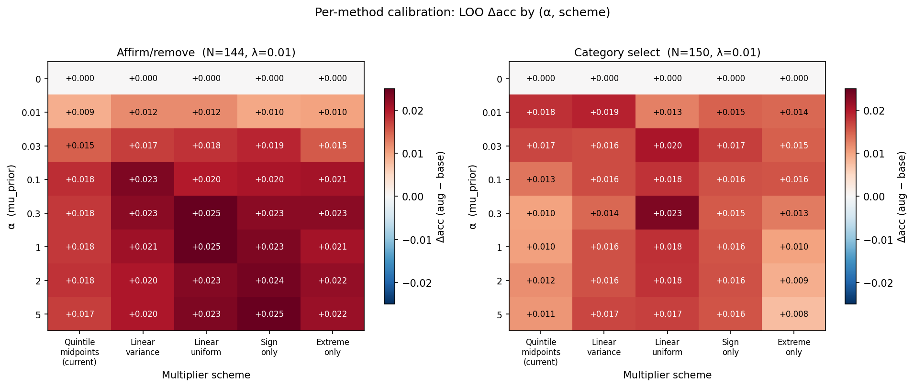

# Method calibration summary

_Generated 2026-05-05 18:20 by `calibrate_methods.py` from `data.csv`._

## What this is

For each inference method, search over (α, multiplier scheme) to find the combination that maximizes mean LOO accuracy lift (`projection_alpha − projection_only`). Reported with 95% CIs.

**Schemes compared:**

| Scheme | Dim weighting | Category spacing |
|---|---|---|
| `quintile_midpoints` | variance-weighted | quintile-derived (nonlinear) |
| `linear_variance` | variance-weighted | linear |
| `linear_uniform` | uniform | linear |
| `sign_uniform` | uniform | binary (love=like, skip=not_into) |
| `extreme_uniform` | uniform | only love/skip count |

**α grid:** [0.0, 0.01, 0.03, 0.1, 0.3, 1.0, 2.0, 5.0]
**λ grid:** [0.001, 0.01, 0.1, 1.0]

Note: post-rescaling, only the *shape* of the prior matters (its L2 norm is normalized). So schemes differ in relative dim weighting and relative category spacing, not absolute magnitude.

## Optimal hyperparameters per method

| Method | N | scheme | α | λ | Δacc | 95% CI |
|---|---|---|---|---|---|---|
| Affirm/remove | 144 | `sign_uniform` | 1.0 | 0.001 | +0.0490 | [+0.0300, +0.0679] |
| Category select | 150 | `linear_uniform` | 0.3 | 0.001 | +0.0350 | [+0.0136, +0.0564] |

## Affirm/remove: top settings

_N = 144. Sorted by mean Δacc, top 8 cells shown._

| scheme | α | λ | Δacc | 95% CI |
|---|---|---|---|---|
| `sign_uniform` | 1.0 | 0.001 | +0.0490 | [+0.0300, +0.0679] |
| `linear_uniform` | 0.3 | 0.001 | +0.0486 | [+0.0309, +0.0663] |
| `sign_uniform` | 2.0 | 0.001 | +0.0486 | [+0.0296, +0.0676] |
| `sign_uniform` | 5.0 | 0.001 | +0.0486 | [+0.0296, +0.0676] |
| `linear_uniform` | 1.0 | 0.001 | +0.0476 | [+0.0299, +0.0652] |
| `linear_uniform` | 2.0 | 0.001 | +0.0472 | [+0.0297, +0.0648] |
| `linear_uniform` | 5.0 | 0.001 | +0.0472 | [+0.0297, +0.0648] |
| `sign_uniform` | 0.1 | 0.001 | +0.0469 | [+0.0285, +0.0653] |

## Category select: top settings

_N = 150. Sorted by mean Δacc, top 8 cells shown._

| scheme | α | λ | Δacc | 95% CI |
|---|---|---|---|---|
| `linear_uniform` | 0.3 | 0.001 | +0.0350 | [+0.0136, +0.0564] |
| `linear_uniform` | 0.1 | 0.001 | +0.0340 | [+0.0128, +0.0552] |
| `linear_uniform` | 1.0 | 0.001 | +0.0337 | [+0.0124, +0.0549] |
| `linear_uniform` | 2.0 | 0.001 | +0.0337 | [+0.0123, +0.0551] |
| `linear_uniform` | 5.0 | 0.001 | +0.0337 | [+0.0123, +0.0551] |
| `linear_variance` | 5.0 | 0.001 | +0.0333 | [+0.0123, +0.0544] |
| `linear_variance` | 1.0 | 0.001 | +0.0330 | [+0.0120, +0.0540] |
| `linear_variance` | 2.0 | 0.001 | +0.0330 | [+0.0119, +0.0541] |

## Reading the heatmap

- Rows: α (feedback prior strength). Columns: multiplier scheme.
- Cell color: mean LOO Δacc. Blue = prior helps; red = prior hurts.
- Black box: argmax cell for that condition.
- α=0 row is the post-rescaling sanity check: must be exactly 0.

## Notes

- **Metric:** mean LOO accuracy lift (augmented − baseline) across participants in the condition.
- **CIs:** 95%, t-distribution with df = n−1.
- **Inclusion:** participants who completed all 20 trials, the summary comparison, and both prediction ratings.
- **Caveat:** the argmax over a discrete grid has selection bias relative to the true optimum, especially when many cells have overlapping CIs. The heatmap is more informative than a single-cell winner.
