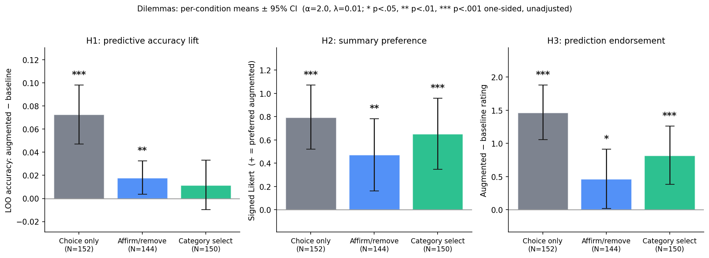

# Dilemmas analysis summary

_Generated 2026-05-05 17:35 by `analyze.py` from `data.csv` (N=446 responses, 446 analyzed)._

## Sample

- **Total responses:** 446
- **Excluded (incomplete):** 0
- **Analyzed:** 446

| Condition | N |
|---|---|
| Choice only | 152 |
| Affirm/remove | 144 |
| Category select | 150 |

## Hyperparameters

| Parameter | Value |
|---|---|
| α (feedback prior strength) | **2.0** |
| λ (L2 regularization) | 0.01 |
| D (number of dimensions) | 10 |
| T (trials per participant) | 20 |
| Inference categories | 5 (per-dim quintile) |

## H1: predictive accuracy lift

Per-participant LOO accuracy (augmented − baseline). Paired one-sided t-test against 0; Holm-Bonferroni across the 3 conditions.

| Condition | N | Δacc | 95% CI | t | p (one-sided) | p_holm | d_z |
|---|---|---|---|---|---|---|---|
| Choice only | 152 | +0.073 | [+0.047, +0.098] | +5.64 | 0.0000 | 0.0000 | +0.46 |
| Affirm/remove | 144 | +0.018 | [+0.004, +0.033] | +2.46 | 0.0075 | 0.0150 | +0.21 |
| Category select | 150 | +0.012 | [-0.010, +0.033] | +1.08 | 0.1416 | 0.1416 | +0.09 |

## H2: summary preference

Signed 6-point Likert (positive = preferred augmented summary). One-sample Wilcoxon, alternative > 0; Holm-Bonferroni across the two inference conditions. `choice_only` is shown as a manipulation check (marked *mc*) and is not part of the H2 family.

| Condition | N | mean | 95% CI | median | W | p (one-sided) | p_holm | r_rb |
|---|---|---|---|---|---|---|---|---|
| Choice only *(mc)* | 152 | +0.80 | [+0.52, +1.07] | +1.0 | 8518.5 | 0.0000 | — | +0.47 |
| Affirm/remove | 144 | +0.47 | [+0.16, +0.78] | +1.0 | 6724.5 | 0.0011 | 0.0011 | +0.29 |
| Category select | 150 | +0.65 | [+0.35, +0.96] | +1.0 | 7768.5 | 0.0000 | 0.0001 | +0.37 |

## H3: prediction endorsement

Per-participant paired difference (augmented − baseline) on a 6-point accuracy rating. One-sample Wilcoxon, alternative > 0; Holm-Bonferroni across the 3 conditions.

| Condition | N | mean Δ | 95% CI | median | W | p (one-sided) | p_holm | r_rb |
|---|---|---|---|---|---|---|---|---|
| Choice only | 152 | +1.47 | [+1.06, +1.88] | +1.0 | 6108.0 | 0.0000 | 0.0000 | +0.63 |
| Affirm/remove | 144 | +0.47 | [+0.02, +0.91] | +0.0 | 3556.0 | 0.0186 | 0.0186 | +0.23 |
| Category select | 150 | +0.82 | [+0.38, +1.26] | +1.0 | 4655.0 | 0.0002 | 0.0005 | +0.37 |

## Notes

- **Sign convention:** positive = preferred augmented model. In `choice_only`, augmented = semantic projection (vs random); in inference conditions, augmented = semantic projection + feedback prior (vs semantic projection alone).
- **Inclusion:** participants who completed all 20 trials, the summary comparison, and both prediction ratings.
- **All p-values are one-sided.** `p_holm` adjusts within each hypothesis family; H2 corrects across the two inference conditions only (`choice_only` H2 is a manipulation check).
- **CIs:** 95%, t-distribution with df = n−1.
- **Effect sizes:** d_z (paired Cohen's d) for H1; r_rb (rank-biserial correlation) for H2 and H3.
