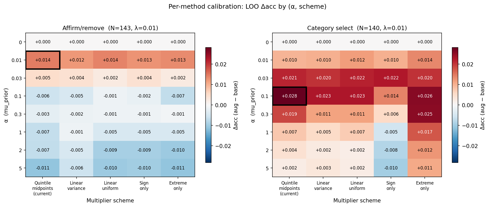

# Method calibration summary

_Generated 2026-05-06 11:17 by `calibrate_methods.py` from `data.csv`._

## What this is

For each inference method, search over (α, multiplier scheme) to find the combination that maximizes mean LOO accuracy lift (`projection_alpha − projection_only`). Reported with 95% CIs.

**Schemes compared:**

| Scheme | Dim weighting | Category spacing |
|---|---|---|
| `quintile_midpoints` | variance-weighted | quintile-derived (nonlinear) |
| `linear_variance` | variance-weighted | linear |
| `linear_uniform` | uniform | linear |
| `sign_uniform` | uniform | binary (love=like, skip=not_into) |
| `extreme_uniform` | uniform | only love/skip count |

**α grid:** [0.0, 0.01, 0.03, 0.1, 0.3, 1.0, 2.0, 5.0]
**λ grid:** [0.01]

Note: post-rescaling, only the *shape* of the prior matters (its L2 norm is normalized). So schemes differ in relative dim weighting and relative category spacing, not absolute magnitude.

## Optimal hyperparameters per method

| Method | N | scheme | α | λ | Δacc | 95% CI |
|---|---|---|---|---|---|---|
| Affirm/remove | 143 | `quintile_midpoints` | 0.01 | 0.01 | +0.0143 | [+0.0035, +0.0252] |
| Category select | 140 | `quintile_midpoints` | 0.1 | 0.01 | +0.0282 | [+0.0120, +0.0444] |

## Affirm/remove: top settings

_N = 143. Sorted by mean Δacc, top 8 cells shown._

| scheme | α | λ | Δacc | 95% CI |
|---|---|---|---|---|
| `quintile_midpoints` | 0.01 | 0.01 | +0.0143 | [+0.0035, +0.0252] |
| `linear_uniform` | 0.01 | 0.01 | +0.0140 | [+0.0036, +0.0244] |
| `extreme_uniform` | 0.01 | 0.01 | +0.0133 | [+0.0030, +0.0236] |
| `sign_uniform` | 0.01 | 0.01 | +0.0126 | [+0.0019, +0.0233] |
| `linear_variance` | 0.01 | 0.01 | +0.0122 | [+0.0014, +0.0230] |
| `quintile_midpoints` | 0.03 | 0.01 | +0.0049 | [-0.0097, +0.0195] |
| `sign_uniform` | 0.03 | 0.01 | +0.0042 | [-0.0096, +0.0180] |
| `linear_variance` | 0.03 | 0.01 | +0.0042 | [-0.0104, +0.0188] |

## Category select: top settings

_N = 140. Sorted by mean Δacc, top 8 cells shown._

| scheme | α | λ | Δacc | 95% CI |
|---|---|---|---|---|
| `quintile_midpoints` | 0.1 | 0.01 | +0.0282 | [+0.0120, +0.0444] |
| `extreme_uniform` | 0.1 | 0.01 | +0.0257 | [+0.0088, +0.0426] |
| `extreme_uniform` | 0.3 | 0.01 | +0.0254 | [+0.0075, +0.0432] |
| `linear_variance` | 0.1 | 0.01 | +0.0229 | [+0.0064, +0.0393] |
| `linear_uniform` | 0.1 | 0.01 | +0.0229 | [+0.0055, +0.0402] |
| `sign_uniform` | 0.03 | 0.01 | +0.0225 | [+0.0097, +0.0353] |
| `linear_uniform` | 0.03 | 0.01 | +0.0218 | [+0.0083, +0.0352] |
| `quintile_midpoints` | 0.03 | 0.01 | +0.0214 | [+0.0078, +0.0351] |

## Reading the heatmap

- Rows: α (feedback prior strength). Columns: multiplier scheme.
- Cell color: mean LOO Δacc. Blue = prior helps; red = prior hurts.
- Black box: argmax cell for that condition.
- α=0 row is the post-rescaling sanity check: must be exactly 0.

## Notes

- **Metric:** mean LOO accuracy lift (augmented − baseline) across participants in the condition.
- **CIs:** 95%, t-distribution with df = n−1.
- **Inclusion:** participants who completed all 20 trials, the summary comparison, and both prediction ratings.
- **Caveat:** the argmax over a discrete grid has selection bias relative to the true optimum, especially when many cells have overlapping CIs. The heatmap is more informative than a single-cell winner.
