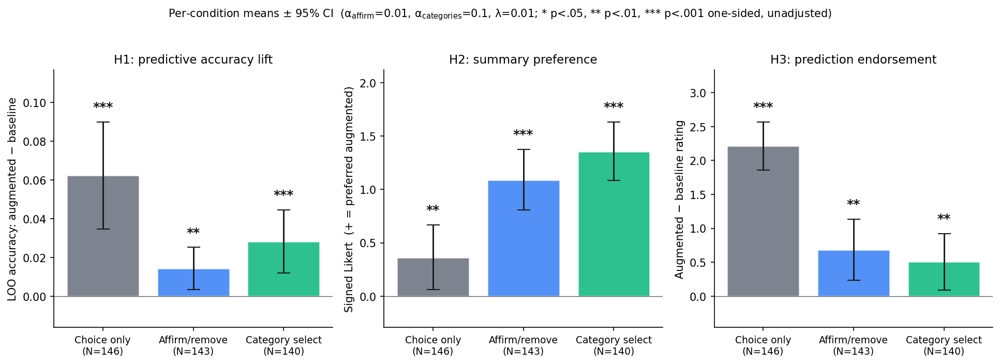

# Dilemmas analysis summary

_Generated 2026-05-06 12:01 by `analyze.py` from `data.csv` (N=429 responses, 429 analyzed)._

## Sample

- **Total responses:** 429
- **Excluded (incomplete):** 0
- **Analyzed:** 429

| Condition | N |
|---|---|
| Choice only | 146 |
| Affirm/remove | 143 |
| Category select | 140 |

## Hyperparameters

| Parameter | Value |
|---|---|
| α affirm/remove | **0.01** |
| α category select | **0.1** |
| λ (L2 regularization) | 0.01 |
| D (number of dimensions) | 10 |
| T (trials per participant) | 20 |
| Inference categories | 5 (per-dim quintile) |

## H1: predictive accuracy lift

Per-participant LOO accuracy (augmented − baseline). Paired one-sided t-test against 0; Holm-Bonferroni across the 3 conditions.

| Condition | N | Δacc | 95% CI | t | p (one-sided) | p_holm | d_z |
|---|---|---|---|---|---|---|---|
| Choice only | 146 | +0.062 | [+0.035, +0.090] | +4.46 | 0.0000 | 0.0000 | +0.37 |
| Affirm/remove | 143 | +0.014 | [+0.003, +0.025] | +2.61 | 0.0050 | 0.0050 | +0.22 |
| Category select | 140 | +0.028 | [+0.012, +0.044] | +3.44 | 0.0004 | 0.0008 | +0.29 |

## H2: summary preference

Signed 6-point Likert (positive = preferred augmented summary). One-sample Wilcoxon, alternative > 0; Holm-Bonferroni across the two inference conditions. `choice_only` is shown as a manipulation check (marked *mc*) and is not part of the H2 family.

| Condition | N | mean | 95% CI | median | W | p (one-sided) | p_holm | r_rb |
|---|---|---|---|---|---|---|---|---|
| Choice only *(mc)* | 146 | +0.36 | [+0.06, +0.67] | +1.0 | 6572.5 | 0.0079 | — | +0.22 |
| Affirm/remove | 143 | +1.09 | [+0.81, +1.38] | +2.0 | 8196.0 | 0.0000 | 0.0000 | +0.59 |
| Category select | 140 | +1.36 | [+1.08, +1.63] | +2.0 | 8439.0 | 0.0000 | 0.0000 | +0.71 |

## H3: prediction endorsement

Per-participant paired difference (augmented − baseline) on a 6-point accuracy rating. One-sample Wilcoxon, alternative > 0; Holm-Bonferroni across the 3 conditions.

| Condition | N | mean Δ | 95% CI | median | W | p (one-sided) | p_holm | r_rb |
|---|---|---|---|---|---|---|---|---|
| Choice only | 146 | +2.21 | [+1.86, +2.57] | +2.0 | 6964.0 | 0.0000 | 0.0000 | +0.89 |
| Affirm/remove | 143 | +0.69 | [+0.23, +1.14] | +0.0 | 3895.5 | 0.0017 | 0.0033 | +0.32 |
| Category select | 140 | +0.51 | [+0.09, +0.92] | +0.0 | 3836.5 | 0.0093 | 0.0093 | +0.26 |

## Notes

- **Sign convention:** positive = preferred augmented model. In `choice_only`, augmented = semantic projection (vs random); in inference conditions, augmented = semantic projection + feedback prior (vs semantic projection alone).
- **Inclusion:** participants who completed all 20 trials, the summary comparison, and both prediction ratings.
- **All p-values are one-sided.** `p_holm` adjusts within each hypothesis family; H2 corrects across the two inference conditions only (`choice_only` H2 is a manipulation check).
- **CIs:** 95%, t-distribution with df = n−1.
- **Effect sizes:** d_z (paired Cohen's d) for H1; r_rb (rank-biserial correlation) for H2 and H3.
