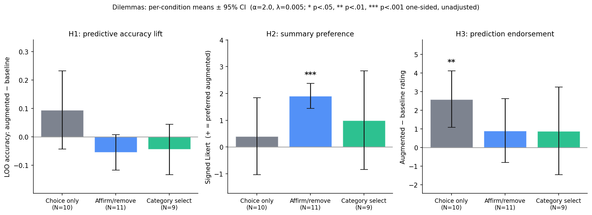

# Dilemmas analysis summary

_Generated 2026-05-05 20:54 by `analyze.py` from `data.csv` (N=30 responses, 30 analyzed)._

## Sample

- **Total responses:** 30
- **Excluded (incomplete):** 0
- **Analyzed:** 30

| Condition | N |
|---|---|
| Choice only | 10 |
| Affirm/remove | 11 |
| Category select | 9 |

## Hyperparameters

| Parameter | Value |
|---|---|
| α (feedback prior strength) | **1.0** |
| λ (L2 regularization) | 0.005 |
| D (number of dimensions) | 10 |
| T (trials per participant) | 20 |
| Inference categories | 5 (per-dim quintile) |

## H1: predictive accuracy lift

Per-participant LOO accuracy (augmented − baseline). Paired one-sided t-test against 0; Holm-Bonferroni across the 3 conditions.

| Condition | N | Δacc | 95% CI | t | p (one-sided) | p_holm | d_z |
|---|---|---|---|---|---|---|---|
| Choice only | 10 | +0.095 | [-0.042, +0.232] | +1.56 | 0.0762 | 0.2285 | +0.49 |
| Affirm/remove | 11 | -0.055 | [-0.117, +0.008] | -1.94 | 0.9592 | 1.0000 | -0.58 |
| Category select | 9 | -0.044 | [-0.133, +0.045] | -1.15 | 0.8587 | 1.0000 | -0.38 |

## H2: summary preference

Signed 6-point Likert (positive = preferred augmented summary). One-sample Wilcoxon, alternative > 0; Holm-Bonferroni across the two inference conditions. `choice_only` is shown as a manipulation check (marked *mc*) and is not part of the H2 family.

| Condition | N | mean | 95% CI | median | W | p (one-sided) | p_holm | r_rb |
|---|---|---|---|---|---|---|---|---|
| Choice only *(mc)* | 10 | +0.40 | [-1.04, +1.84] | +1.0 | 33.5 | 0.2920 | — | +0.22 |
| Affirm/remove | 11 | +1.91 | [+1.44, +2.38] | +2.0 | 66.0 | 0.0005 | 0.0010 | +1.00 |
| Category select | 9 | +1.00 | [-0.84, +2.84] | +2.0 | 33.0 | 0.1289 | 0.1289 | +0.47 |

## H3: prediction endorsement

Per-participant paired difference (augmented − baseline) on a 6-point accuracy rating. One-sample Wilcoxon, alternative > 0; Holm-Bonferroni across the 3 conditions.

| Condition | N | mean Δ | 95% CI | median | W | p (one-sided) | p_holm | r_rb |
|---|---|---|---|---|---|---|---|---|
| Choice only | 10 | +2.60 | [+1.08, +4.12] | +3.5 | 28.0 | 0.0078 | 0.0234 | +1.00 |
| Affirm/remove | 11 | +0.91 | [-0.80, +2.62] | +1.0 | 28.5 | 0.0898 | 0.1797 | +0.58 |
| Category select | 9 | +0.89 | [-1.46, +3.24] | +1.0 | 20.0 | 0.2109 | 0.2109 | +0.43 |

## Notes

- **Sign convention:** positive = preferred augmented model. In `choice_only`, augmented = semantic projection (vs random); in inference conditions, augmented = semantic projection + feedback prior (vs semantic projection alone).
- **Inclusion:** participants who completed all 20 trials, the summary comparison, and both prediction ratings.
- **All p-values are one-sided.** `p_holm` adjusts within each hypothesis family; H2 corrects across the two inference conditions only (`choice_only` H2 is a manipulation check).
- **CIs:** 95%, t-distribution with df = n−1.
- **Effect sizes:** d_z (paired Cohen's d) for H1; r_rb (rank-biserial correlation) for H2 and H3.
